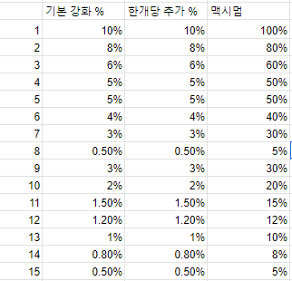

# 강화

아이템 레벨이란?\
\
아이템  레벨이 증가 될수록 몹에게서 받는 피해량이 감소됩니다.\
\- 고정 피해는 피해량이 감소 되지 않습니다.\
\- 기믹 파훼 실패시 받는 피해량은 무조건 죽게끔 설계 되어 있습니다.\
\- 감소 되는 피해량은 깡 대미지, 최대 체력 비례 피해 두가지입니다.

현재 계산식

최종 받는 피해량 = (받는 피해 \* (1 - (아이템 레벨 / (받는 피해 \*2.5 + 아이템 레벨)))) \* (1- 피해량 경감(저항, 오라 방어막, 스텟표기 피해량 경감 수치의 총합 %))

예시 : 아이템레벨이 5000이고 받는 피해량이 2500일 경우

2500 \* ( 1 - ( 5000 / ( 6250 + 5000)))) \* 1.0 = 2500 \* 0.55 = 1375 이 피격됩니다.

1. 방어구 강화\
   전직 이후 기본 지급되는 네더라이트 방어구에 강화 가능합니다.

<figure><figcaption></figcaption></figure>

기본 강화 재료는 청금석 블럭을 소비하여 모든 강화에 기초가 되는 아이템인 **은빛 주괴** 아이템으로 다양한 강화 아이템을 조합 하실수 있습니다.

<figure><figcaption></figcaption></figure>

해당 강화 재료로 다양한 강화 아이템으로 조합 하실수 있으며 그냥 강화해도 됩니다.

실패시 **아이템 파괴**는 없습니다.

맥시멈 강화 수치는 부위당 +750입니다. 750을 넘어갔을 경우 750으로 재 조정 됩니다.\
맥시멈 강화를 한 이후 특수한 재료를 모아 다음 방어구로 강화가 가능합니다.\
이후 방어구들은 추가적인 강화 재료를 요구하지 않습니다.

2. 증표 강화

<figure><figcaption></figcaption></figure>

증표 강화는 일반 도감을 한개씩 활성화 할 경우 각 티어에 맞는 강화 재료를 습득합니다.\
해당 장비와 강화 재료는 룰을 여겼을경우 즉시 처분합니다.

<figure><figcaption>
도감 달성시 지급되는 아이템입니다.
</figcaption></figure>

해당 강화는 무제한으로 강화 가능합니다.

3. 팔찌 강화

해당 강화는 엔드급 강화로 설계 되어 있습니다.

<figure><figcaption></figcaption></figure>

10종류의 팔찌가 존재하며 조합에 대한 난이도도 상당하며 특수 재료들을 요구합니다.

강화 재료는 <mark style="color:red;">**고대 유물의 잔재**</mark> 아이템을 요구합니다.

<figure><figcaption></figcaption></figure>

해당 강화는 무제한입니다. 강화 차수가 올라갈수록 확률이 감소됩니다.

7강화까지는 강화 차수가 감소 되지 않으며 7강 이후로는 실패 할 경우 7강화로 변경됩니다.

고대 유물의 잔재 아이템은 한번 강화할때마다 최대 10개까지 투입 가능합니다.

<figure><figcaption>
팔찌 강화 확률표
</figcaption></figure>

4. 장갑 강화

장갑 아이템은 상위협동 레이드에서 드롭 되는 장갑 아이템으로 강화가 가능합니다.

<figure><figcaption></figcaption></figure>

해당 창에서 강화가 가능하며 장갑을 진화시키기 위해서는 장갑을 10강화까지 올리고 추가 재료를 투입 할 경우 다음 장갑으로 진화가 가능합니다.

철벽의 기사 매그너스 : 디펜스 오브 가디언\
백의의 천사 한설아 : 디스트로이 디프레션\
천상의 규율 시그룬 : 가디언 오브 디서플린
