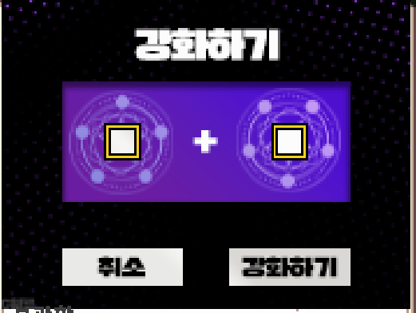

# 아이템 레벨

아이템  레벨이 증가 될수록 몹에게서 받는 피해량이 감소됩니다.\
\- 고정 피해는 피해량이 감소 되지 않습니다.\
\- 기믹 파훼 실패시 받는 피해량은 무조건 죽게끔 설계 되어 있습니다.\
\- 감소 되는 피해량은 깡 대미지, 최대 체력 비례 피해 두가지입니다.

현재 계산식

최종 받는 피해량 = (받는 피해 \* (1 - (아이템 레벨 / (받는 피해 \*2.0 + 아이템 레벨)))) \* (1- 피해량 경감(저항, 오라 방어막, 스텟표기 피해량 경감 수치의 총합 %))

예시 : 아이템레벨이 5000이고 받는 피해량이 2500일 경우

2500 \* ( 1 - ( 5000 / ( 5000 + 5000 ) ) ) \* 1.0 = 2500 \* 0.5 = 1250 이 피격됩니다.

방어구 강화\
전직 이후 기본 지급되는 네더라이트 방어구에 강화 가능합니다.

<figure><figcaption></figcaption></figure>

기본 강화 재료는 <mark style="color:$primary;">청금석 블럭7개</mark> 또는 <mark style="color:blue;">신비한 기운의 물고기</mark>, <mark style="color:yellow;">대지의 기운이 담긴 열매</mark> 소비하여 모든 강화에 기초가 되는 아이템인 **은빛 주괴** 아이템으로 다양한 강화 아이템을 조합 하실수 있습니다.

<figure><figcaption></figcaption></figure>

해당 강화 재료로 다양한 강화 아이템으로 조합 하실수 있으며 그냥 강화해도 됩니다.

실패시 **아이템 파괴**는 없습니다.

맥시멈 강화 수치는 부위당 +750입니다. 750을 넘어갔을 경우 750으로 재 조정 됩니다.\
맥시멈 강화를 한 이후 특수한 재료를 모아 다음 방어구로 강화가 가능합니다.\
이후 방어구들은 추가적인 강화 재료를 요구하지 않습니다.
