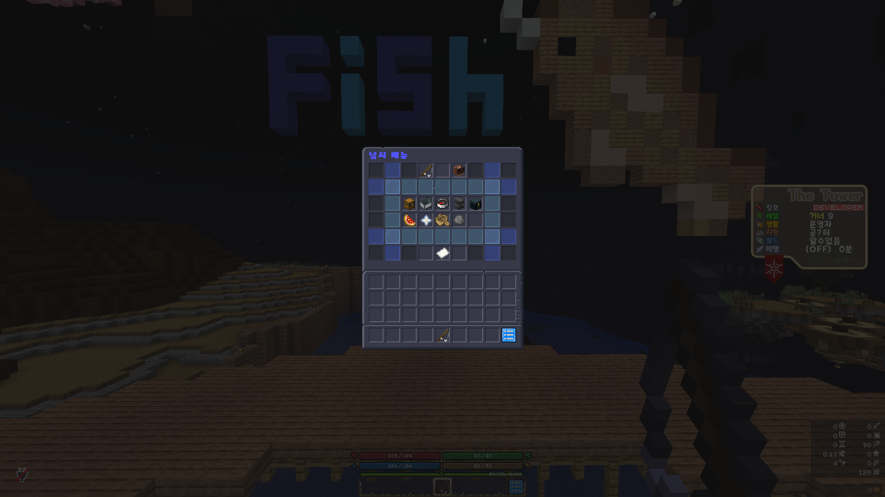

# 낚시

<figure><figcaption></figcaption></figure>

물고기의 등급은 브론즈, 실버, <mark style="color:yellow;">골드</mark>, <mark style="color:blue;">다이아몬드</mark>, <mark style="color:green;">플레티넘</mark>, <mark style="color:purple;">전설,</mark> <mark style="color:orange;">신화</mark>가 있습니다.\
(신화등급의 물고기도 전설미끼의 영향을 받습니다.)

브론즈 등급의 물고기를 낚았을 때, 4% 확률로 신비한 기운의 물고기를 획득 하실 수 있습니다.\
(어부는 8% 확률로 획득합니다.)

확률에 의해 낚아 올릴 때 등급이 결정됩니다.

<mark style="color:purple;">전설</mark>등급 물고기는 '[<mark style="color:yellow;">신화 요리</mark>](../undefined-5/)'의 재료로 사용이 가능합니다.\
<mark style="color:orange;">신화</mark>등급 물고기는 '[<mark style="color:orange;">신화 도감</mark>](../../undefined-3/undefined-3.md)'에 등록 가능합니다.

각 등급 물고기마다 다른 가격으로 판매가 됩니다.

물고기 판매로 얻을 수 있는 금액은 일일 1000만원으로 제한되어있습니다.\
(어부도 동일)
