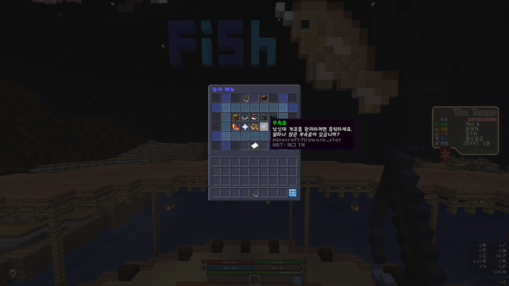
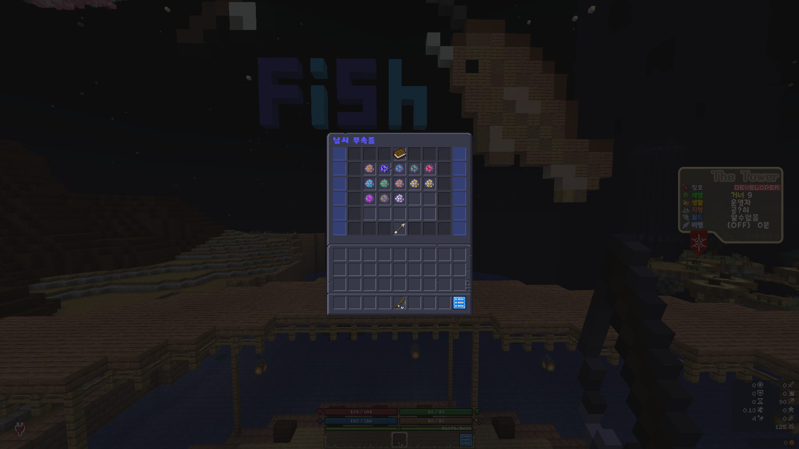

# 낚시 부속품

부속품은 낚시 메뉴의 부속품 탭에서 확인 하실 수 있습니다.

<figure><figcaption></figcaption></figure>

<figure><figcaption></figcaption></figure>

부속품의 조합은 가마솥에 재료를 버려 던진 다음 낚싯대를 들고 클릭하여 제작합니다.\
제작된 부속품은 부속품 메뉴에서 낚싯대에 장착할 수 있으며, 강화는 동일한 부속품을 추가로 낚싯대에 적용시킬 때마다 1레벨씩 상승합니다.

부속품의 종류 및 조합법은 아래와 같습니다.

\
핫 스팟(Hot spot) \
낚싯대로 물고기를 잡을때마다 한 마리 이상의 물고기를 획득 가능한 확률을 생성합니다. \
비가 오지 않을 때만 작동합니다. \
요구 낚시 레벨 : 10 \
제작 시 소모되는 엔트로피 : 50,000 \
최대 강화 레벨 : 13 \
재료 : 반짝이는 수박 조각 16개, 실 32개, 네더의 별 1개, 참나무 보트 1개, 돌고래 꼬리 4개

폭풍의 부름(Call of the storm) \
비가 내릴 때, 낚싯대를 물고기를 잡을때마다 한 마리 이상의 물고기를 획득 가능한 확률을 생성합니다. \
비가 내릴 때만 적용됩니다. \
요구 낚시 레벨 : 12 \
제작 시 소모되는 엔트로피 : 40,000 \
최대 강화 레벨 : 5 \
재료 : 물 양동이 1개, 참나무 보트 1개, 대구 16개, 수련잎 4개, 스폰지 4개

포화(Saturate) \
물고기를 잡을 때 배고픔을 회복할 수 있는 기회를 줍니다. \
요구 낚시 레벨 : 12 \
제작 시 소모되는 엔트로피 : 35,000 \
최대 강화 레벨 : 5 \
재료 : 스테이크 16개, 케이크 1개, 구운 감자 12개, 대구 16개

게 미끼(Crab bait) \
낚시할 때 게를 잡을 확률이 증가합니다. \
요구 낚시 레벨 : 25 \
제작 시 소모되는 엔트로피 : 40,000 \
최대 강화 레벨 : 5 \
재료 : 물 양동이 1개, 게의 집게 10개, 게의 껍질 20개, 실 64개

현자(Sage) \
낚시로 물고기를 잡을 때 낚시 경험치를 더 많이 줍니다. \
요구 낚시 레벨 : 12 \
제작 시 소모되는 엔트로피 : 57,500 \
최대 강화 레벨 : 10 \
재료 : 금 블럭 8개, 게의 껍질 16개, 게의 집게 16개, 돌고래 꼬리 3개, 화약 4개, 레드스톤 16개, 설탕 16개

정밀절단(Precision cutting) \
물고기 분해를 이용해 분해 할때마다 더 많은 엔트로피를 지급합니다. \
레벨이 높을수록 더 많은 엔트로피를 획득 가능합니다. \
요구 낚시 레벨 : 22 \
제작 시 소모되는 엔트로피 : 70,000 \
최대 강화 레벨 : 8 \
재료 : 모루 1개, 다이아몬드 칼 1개, 철 도끼 1개, 조약돌 16개, 에메랄드 2개, 청금석 블럭 3개, 물 양동이 1개, 앵무조개 껍데기 6개

지능(Intellect) \
낚시로 물고기를 잡을 때 플레이어 XP를 더 많이 줍니다. \
요구 낚시 레벨 : 25 \
제작 시 소모되는 엔트로피 : 50,000 \
최대 강화 레벨 : 10 \
재료 : 청금석 블럭 20개, 책 8개, 다이아몬드 8개, 에메랄드 블럭 8개, 게의 껍질 16개

지각(Perception) \
커스텀 물고기를 잡을 때 더 많은 기본 엔트로피를 제공합니다. \
요구 낚시 레벨 : 28 \
제작 시 소모되는 엔트로피 : 75,000 \
최대 강화 레벨 : 7 \
재료 : 유리 32개, 발광석 4개, 거북이 알 3개, 앵무조개 껍데기 3개, 게의 집게 10개

트로피(Trophy) \
물고기 저울 기능을 사용할 때 더 높은 수익을 올릴 확률을 제공합니다. \
요구 낚시 레벨 : 35 \
제작 시 소모되는 엔트로피 : 60,000 \
최대 강화 레벨 : 6 \
재료 : 철 블럭 32개, 금 블럭 16개, 다이아몬드 블럭 12개, 에메랄드 블럭 12개, 오징어 촉수 16개, 바다의 심장 1개

마스터 낚시꾼(Master fisherman) \
더 높은 등급의 물고기를 잡을 확률을 증가시킵니다. 더 많은 엔트로피를 얻을 수 있습니다. \
요구 낚시 레벨 : 45 \
제작 시 소모되는 엔트로피 : 120,000 \
최대 강화 레벨 : 20 \
재료 : 네더의 별 5개, 가스트의 눈물 8개, 게의 집게 16개, 게의 껍질 16개, 돌고래 꼬리 8개, 오징어 촉수 12개, 바다의 심장 2개

태양의 분노(Solar rage) \
낚시 상점에서 물고기를 판매할 때 얻는 돈을 증가시킵니다. \
요구 낚시 레벨 : 35 \
제작 시 소모되는 엔트로피 : 75,000 \
최대 강화 레벨 : 5 재료 : 금 블럭 8개, 다이아몬드 블럭 5개, 에메랄드 블럭 12개, 게의 집게 10개, 게의 껍질 10개, 오징어 촉수 10개

