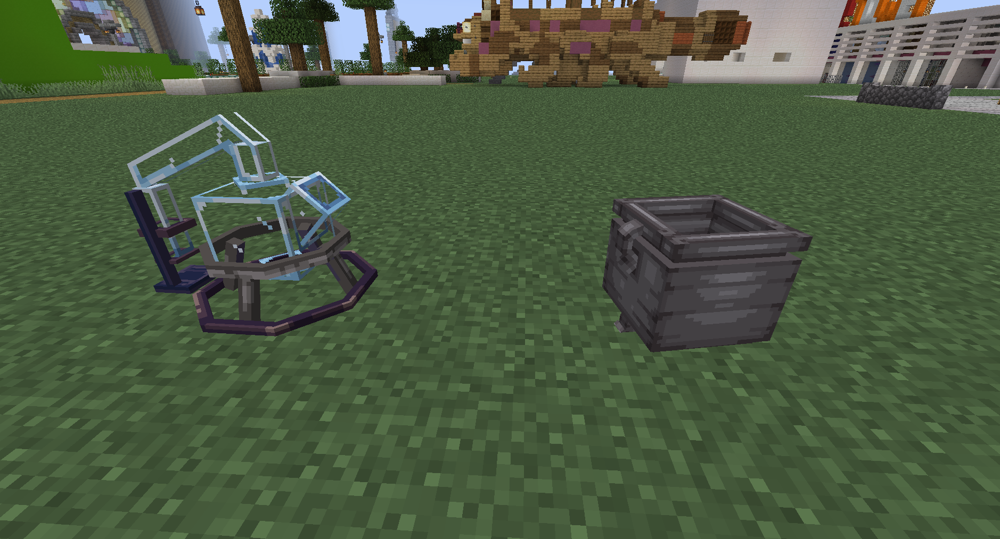
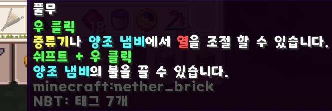
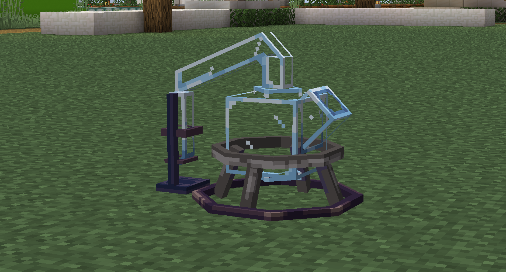
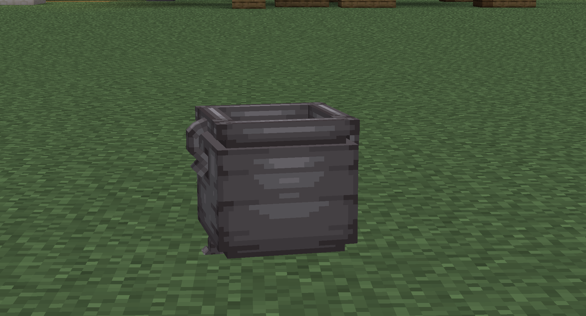

# 연금술

<figure><figcaption></figcaption></figure>

<figure><figcaption></figcaption></figure>

<figure><figcaption></figcaption></figure>

<figure><figcaption></figcaption></figure>

<figure><figcaption></figcaption></figure>

등급에 맞는 이용권을 구매하신뒤 사용하시면 일정시간(10분)동안 연금술 이용이 가능합니다.\
상위 단계 이용권 사용 시, 하위단계 연금술까지 가능합니다.

연금술을 하기 위해선 다음과 같은 아이템이 요구됩니다.\
연금술은 두가지 단계를 거칩니다.

1. 증류 단계

<figure><figcaption></figcaption></figure>

증류 단계에서는 세 가지의 베이스 재료가 요구됩니다.\
베이스 재료는 깨끗한 물, 기름, 에탄올 세개중 하나를 증류대에 대고 우클릭을 하면 베이스 재료가 투입됩니다.\
증류 단계를 하기 위해서는 [증류 단계 레시피 문서](undefined.md)를 참고하여 재료를 확인 해주세요

2. 양조 단계

<figure><figcaption></figcaption></figure>

양조 단계에는 여러가지 타입이 존재합니다. 각 타입별로 만들수 있는 물약과 비약의 종류가 달라집니다.\
기본 재료로는 깨끗한 물 아이템과 촉매제 재료를 요구합니다.\
양조 단계를 하기 위해서 [양조 단계 레시피 문서](undefined-1.md)를 참고 해주세요
