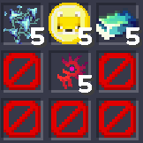
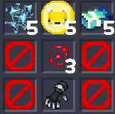
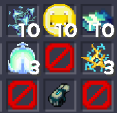
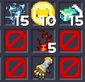

# 모험가의 의지

#### 일반 모험가의 의지

<figure><figcaption></figcaption></figure>

LV.70 착용 가능 \
아이템 레벨 +100 스킬 피해량 +1% 물리 피해량 +1% 스킬 쿨타임 감소 0.5% \
\
코어 칸 3개

* 일반 룬을 장착 할 수 있습니다.

#### 희귀 모험가의 의지

<figure><figcaption></figcaption></figure>

LV.80 착용 가능 \
아이템 레벨 +200 스킬 피해량 +2% 물리 피해량 +2% 스킬 쿨타임 감소 1% \
\
코어 칸 3개

* 일반 룬을 장착 할 수 있습니다.

#### 전설 모험가의 의지

<figure><figcaption></figcaption></figure>

LV.90 착용 가능 \
아이템 레벨 +300 스킬 피해량 +4% 물리 피해량 +4% 마나 회복 + 0.05% 스킬 쿨타임 감소 1.5% \
\
코어 칸 3개

* 일반 룬을 장착 할 수 있습니다.

#### 신화 모험가의 의지

<figure><figcaption></figcaption></figure>

LV.100 착용 가능 \
아이템 레벨 +400 스킬 피해량 +6% 물리 피해량 +6% 스킬 쿨타임 감소 2% 마나 회복 + 0.12% \
\
코어 칸 3개

* 고급 룬을 장착 할 수 있습니다.

#### 유일 모험가의 의지

LV.110 착용 가능 \
아직 존재하지 않습니다.

**주의사항**
\
코어가 장착 된 모험가의 의지를 다음 등급으로 강화 할 때 모든 코어가 소멸합니다.
\
유지 하고 싶으신 코어가 있으시다면 코어 제거기를 사용 해주세요.
